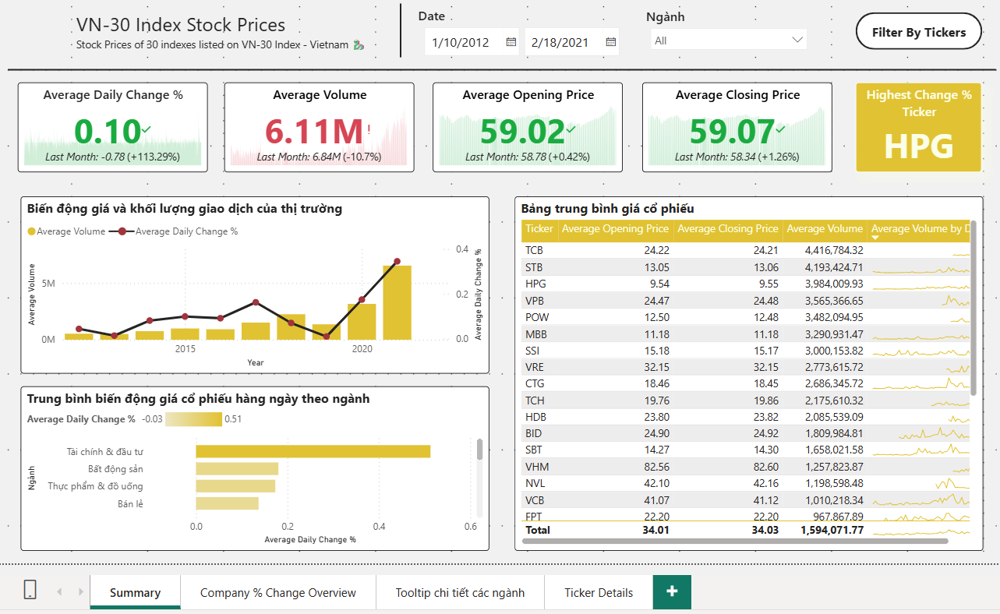
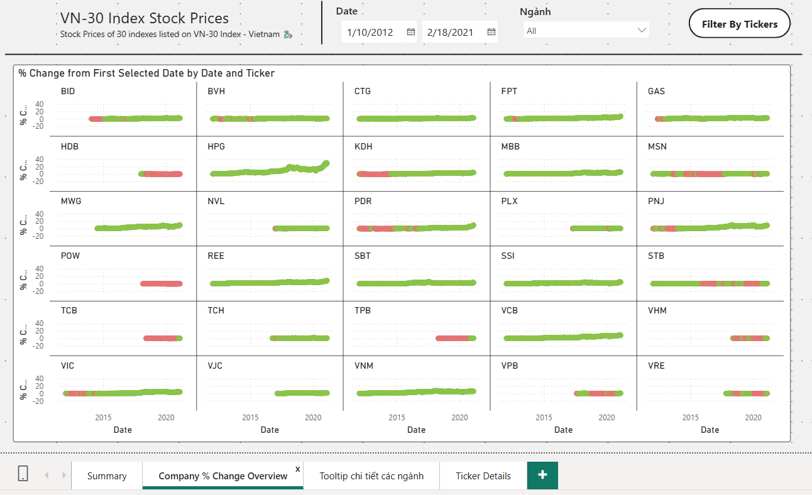
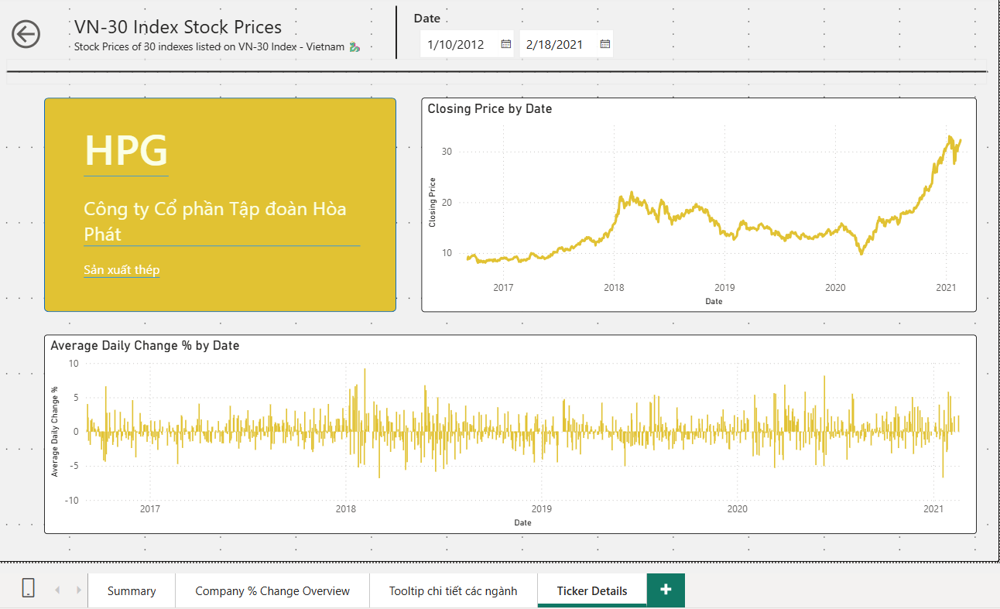

# 📊 VN30 Stock Price Analysis Dashboard (Power BI)

> **Power BI Dashboard phân tích dữ liệu giá cổ phiếu VN30 Index**  
> Thực hiện đầy đủ quy trình phân tích dữ liệu từ thu thập, làm sạch, mô hình hóa đến trực quan hóa, nhằm phân tích xu hướng thị trường và hỗ trợ ra quyết định đầu tư.

*Power BI Dashboard phân tích dữ liệu giá cổ phiếu VN30 Index*  



## 📌 Mục lục
- [1. Tổng quan dự án](#1-tổng-quan-dự-án)
- [2. Dataset](#2-dataset)
- [3. Quy trình phân tích dữ liệu (ETL)](#3-quy-trình-phân-tích-dữ-liệu-etl)
- [4. Data Modeling](#4-data-modeling)
- [5. Cấu trúc Dashboard](#5-cấu-trúc-dashboard)
- [6. Phân tích chi tiết](#6-phân-tích-chi-tiết)
- [7. Insights](#7-insights)
- [8. Liên hệ thực tiễn](#8-liên-hệ-thực-tiễn)
- [9. Công cụ & Kỹ thuật sử dụng](#9-công-cụ--kỹ-thuật-sử-dụng)
- [10. Hạn chế & Hướng phát triển](#10-hạn-chế--hướng-phát-triển)

---

## 1. Tổng quan dự án

Dự án này xây dựng **Dashboard Power BI phân tích dữ liệu giá cổ phiếu VN30 Index**, tập trung vào:

- Theo dõi **biến động giá cổ phiếu theo thời gian**
- Phân tích **xu hướng thị trường**
- So sánh **hiệu suất các mã cổ phiếu VN30**
- Hỗ trợ **phân tích và ra quyết định đầu tư**

---

## 2. Dataset

### 🔹 Nguồn dữ liệu
- **Kaggle – VN30 Stock Price Dataset**

### 🔹 Mô tả dữ liệu
- Dataset gồm **30 file CSV**, mỗi file tương ứng với **1 mã cổ phiếu thuộc VN30**
- Mỗi file chứa dữ liệu giao dịch theo ngày

### 🔹 Các trường dữ liệu
| Cột dữ liệu | Mô tả |
|------------|------|
| `Ticker` | Mã cổ phiếu |
| `DTYYYMMDD` | Ngày giao dịch |
| `Open` | Giá mở cửa |
| `High` | Giá cao nhất |
| `Low` | Giá thấp nhất |
| `Close` | Giá đóng cửa |
| `Volume` | Khối lượng giao dịch |

---

## 3. Quy trình phân tích dữ liệu (ETL)

### 🔹 Extract
- Tải dataset từ Kaggle
- Load toàn bộ các file CSV vào Power BI

### 🔹 Transform
- Gộp 30 file CSV thành **một bảng duy nhất**
- Đổi tên bảng thành: `StockPrices`
- Chuẩn hóa tên cột:
  - `Ticker`
  - `Date`
  - `Open`
  - `High`
  - `Low`
  - `Close`
  - `Volume`

### 🔹 Load
- Dữ liệu sau khi làm sạch được sử dụng trực tiếp cho phân tích và trực quan hóa

---

## 4. Data Modeling

### 🔹 Các bảng dữ liệu

#### `StockPrices`
- Bảng dữ liệu chính chứa thông tin giá cổ phiếu theo ngày

#### `CompanyDetails`
- Bảng bổ sung thông tin doanh nghiệp:
  - Tên công ty
  - Ngành
  - Mã cổ phiếu

#### `DateTable`
Bảng thời gian được tạo bằng DAX để phục vụ phân tích theo thời gian:

```DAX
DateTable =
CALENDAR(
    MIN(StockPrices[Date]),
    MAX(StockPrices[Date])
) 
```

### 🔹 Relationship

- `DateTable[Date]` → `StockPrices[Date]` (**One-to-Many**)  
- `CompanyDetails[Mã cổ phiếu]` → `StockPrices[Ticker]` (**One-to-Many**)

📐 Mô hình dữ liệu được thiết kế theo **Star Schema**, giúp:
- Tối ưu hiệu năng xử lý dữ liệu
- Đơn giản hóa các phép tính DAX
- Dễ dàng mở rộng dashboard trong tương lai

---

## 5. Cấu trúc Dashboard

Dashboard gồm **3 trang phân tích chính**, mỗi trang phục vụ một mục tiêu phân tích cụ thể.

---

### 📍 Trang 1: Summary

Trang **Summary** cung cấp cái nhìn tổng quan về thị trường VN30, bao gồm:

- Tổng quan biến động thị trường
- Các **KPI chính** về:
  - Trung bình % thay đổi giá cổ phiếu theo ngày
  - Trung bình khối lượng giao dịch
  - Trung bình giá mở cửa và giá đóng cửa
- Phân tích **xu hướng theo thời gian**
- So sánh **hiệu suất theo ngành và theo mã cổ phiếu**

📷 *Screenshot Dashboard – Summary*  


---

### 📍 Trang 2: Company % Change Overview

Trang này trình bày dữ liệu dưới dạng **lưới (matrix)**, tập trung vào:

- Phân tích **% thay đổi giá cổ phiếu** tại từng thời điểm
- So sánh mức tăng trưởng của các mã cổ phiếu trong cùng một khoảng thời gian
- Hỗ trợ nhanh chóng xác định các mã có hiệu suất vượt trội hoặc kém hiệu quả

📷 *Screenshot Dashboard – Company % Change Overview*  


---

### 📍 Trang 3: Ticker Details

Trang **Ticker Details** sử dụng tính năng **Drill Through** từ trang Summary để phân tích chi tiết từng mã cổ phiếu.

Nội dung bao gồm:
- Biểu đồ đường thể hiện **giá đóng cửa theo thời gian**
- Trung bình **biến động giá cổ phiếu theo ngày**
- Thông tin chi tiết về:
  - Tên công ty
  - Ngành hoạt động

📷 *Screenshot Dashboard – Ticker Details*  


---

## 6. Phân tích chi tiết

### 🔹 Tổng quan giai đoạn 2012–2021

Trong giai đoạn từ **2012 đến 2021**, thị trường VN30 có những đặc điểm nổi bật:

- Trung bình **% thay đổi giá cổ phiếu có xu hướng tăng**
- Giá mở cửa và giá đóng cửa tăng dần theo thời gian
- Khối lượng giao dịch trung bình có xu hướng **giảm**
- Mã cổ phiếu có mức tăng trưởng lớn nhất:
  - **HPG – Công ty Cổ phần Tập đoàn Hòa Phát**

---

### 🔹 Phân tích theo ngành

Các ngành có mức **biến động giá cổ phiếu mạnh nhất** gồm:

- Tài chính & Đầu tư
- Bất động sản
- Thực phẩm & Đồ uống

Những ngành này thể hiện mức độ nhạy cảm cao với biến động thị trường.

---

### 🔹 Giá cổ phiếu & thanh khoản

- Các mã có **giá cổ phiếu trung bình cao**:
  - `VJC`, `VHM`
- Các mã có **khối lượng giao dịch trung bình cao** (thanh khoản tốt):
  - `TCB`, `STB`

---

## 7. Insights

- Thị trường VN30 có **xu hướng tăng trưởng dài hạn** trong giai đoạn 2012–2021
- **HPG** là mã cổ phiếu có mức tăng trưởng vượt trội nhất trong toàn bộ giai đoạn
- Khối lượng giao dịch giảm mạnh vào **năm 2019** do ảnh hưởng của **đại dịch Covid-19**
- Các ngành:
  - Tài chính
  - Bất động sản
  - Thực phẩm & Đồ uống  
  là những ngành có mức biến động giá cao nhất

---

## 8. Liên hệ thực tiễn

- Sự sụt giảm mạnh của thị trường năm 2019 phù hợp với bối cảnh đại dịch Covid-19
- Ngành ngân hàng thể hiện **tính ổn định cao**, với mức tăng trưởng đều ở các mã:
  - `VCB`, `BID`
- Sự tăng trưởng mạnh của **HPG** có thể đến từ:
  - Mở rộng năng lực sản xuất (Dự án Dung Quất giai đoạn 2017–2021)
  - Kết quả tài chính vượt trội trong năm 2020

---

## 9. Công cụ & Kỹ thuật sử dụng

- Power BI
- Power Query
- DAX
- Data Modeling (Star Schema)
- KPI & Advanced Tooltip
- Drill Through
- Time Series Analysis

---

## 10. Hạn chế & Hướng phát triển

### 🔹 Hạn chế
- Chưa tích hợp các yếu tố kinh tế vĩ mô (GDP, lãi suất, CPI)
- Dataset kết thúc ở năm 2021

### 🔹 Hướng phát triển
- Tích hợp dữ liệu kinh tế vĩ mô để phân tích chuyên sâu hơn
- Phân tích rủi ro và độ biến động giá (Volatility)
- Mở rộng sang mô hình **dự báo giá cổ phiếu**

